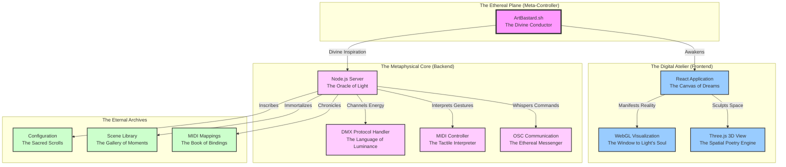
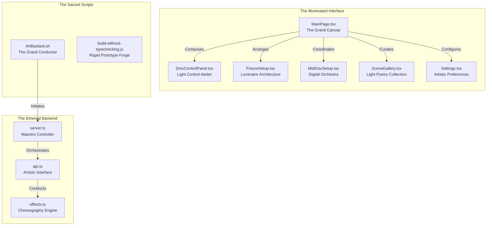
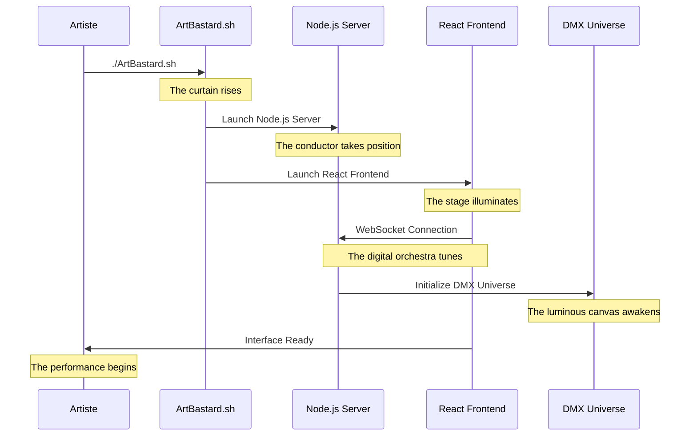
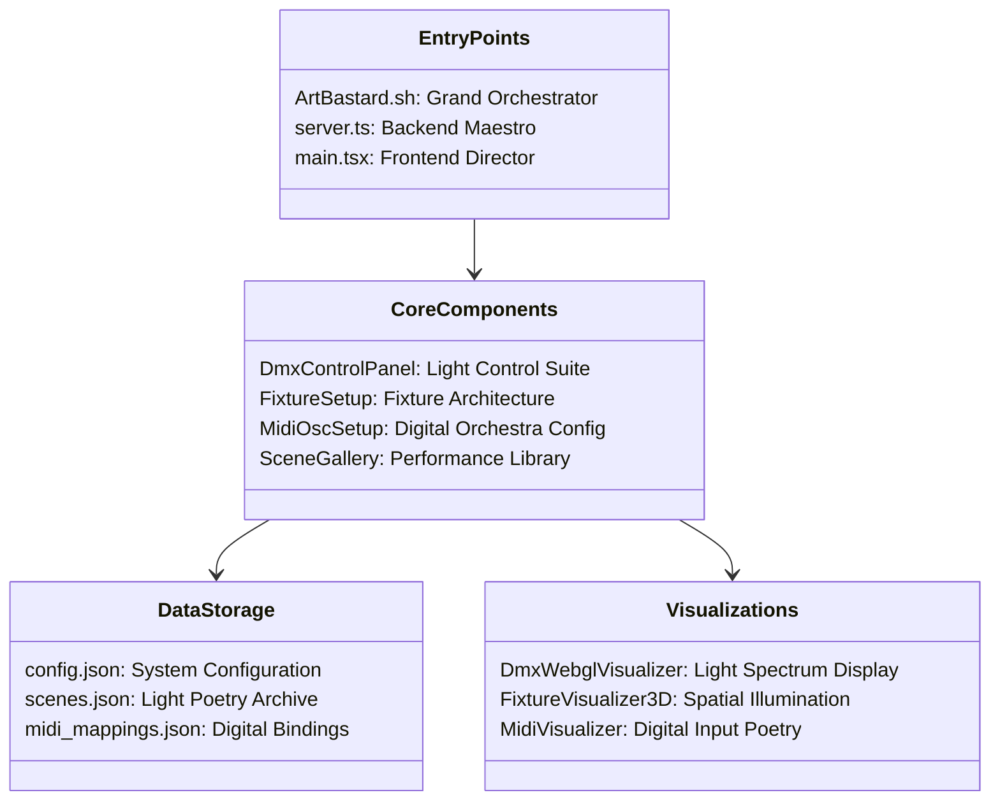
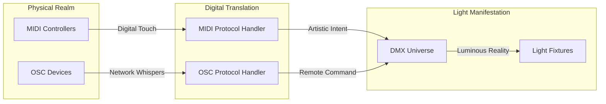

# ArtBastard DMX512FTW: The Grand Architecture

*"In the grand theater of digital illumination, where technology and artistry engage in their eternal dance, each pixel becomes a brushstroke in the canvas of reality."*

## 🎭 Overture: Installation & Setup

Before embarking on your journey through the realms of digital luminescence:

1. **Prepare the Canvas**
   ```bash
   git clone https://github.com/aday01/ArtBastard_DMX512FTW.git
   cd ArtBastard_DMX512FTW
   ```

2. **Mix the Digital Pigments**
   ```bash
   npm install        # Backend palette preparation
   cd react-app
   npm install        # Frontend canvas materials
   cd ..
   ```

3. **Prime the Canvas**
   ```bash
   ./ArtBastard.sh setup
   ```

4. **Begin the Performance**
   ```bash
   ./ArtBastard.sh start
   ```

5. **Enter the Gallery**
   - Open your web browser to `http://localhost:3001`
   - The digital atelier awaits your creative direction

## 🎨 System Overview: A Critical Analysis

*"In this post-modern interpretation of the DMX protocol, we witness the delicate interplay between the physical and digital realms, where each bit transforms into a quantum of artistic expression."*



## 🎭 Component Roles



## 🎼 Launch Sequence



## 📁 File Purposes



## 🎹 MIDI & OSC Flow



*"Each connection is a brushstroke, each protocol a color, and together they paint with light upon the canvas of reality."*

## 🎨 Requirements

- Node.js 18.x or higher (The Foundation of our Digital Atelier)
- Modern web browser with WebGL2 support (The Window to our Light Universe)
- Compatible DMX interface (The Bridge to Physical Reality)
- MIDI controllers (optional) (The Tactile Poetry Instruments)
- OSC-capable devices (optional) (The Remote Whisperers)

## 🎭 Troubleshooting: When the Light Falters

*"Even in the realm of digital art, shadows sometimes obscure our path..."*

1. **The Curtain Refuses to Rise**
   ```bash
   # Cleanse the stage
   rm -rf node_modules
   rm -rf react-app/node_modules
   # Rebuild the set
   ./ArtBastard.sh setup
   ```

2. **The Orchestra is Silent**
   - Ensure your MIDI devices are connected before launching
   - Verify permissions with `sudo chmod a+rw /dev/snd/*`

3. **The Canvas Remains Dark**
   - Check DMX interface connections
   - Verify WebGL support: `chrome://gpu`

## Usage

To begin the artistic journey:

1. Execute `./ArtBastard.sh` - The grand conductor of our luminous orchestra
2. Select your desired movement from the artistic menu
3. Allow the digital muses to guide your creative expression

Remember: The interface adapts to your artistic temperament through three distinct themes:
- **Art Critic**: For those who appreciate the verbose beauty of artistic expression
- **Standard**: For the pragmatic illuminator
- **Minimal**: For the pure essence of light control

_"Let the dance of photons begin!"_

## 🌟 Join the Artistic Movement

*"Every contribution adds a new hue to our collective masterpiece..."*

- Star our repository (Illuminate our path)
- Report issues (Document the shadows)
- Submit pull requests (Add your brushstrokes)
- Share your light scenes (Expand our gallery)

_"For in the end, we are all but conductors of light, orchestrating the eternal dance of photons across the stage of reality."_