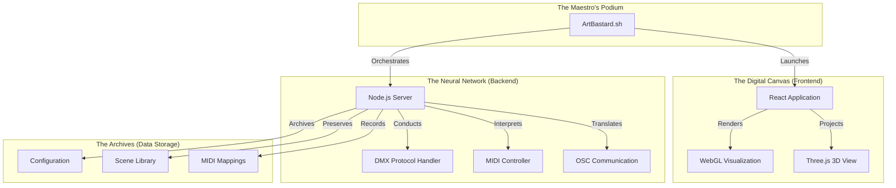

# ArtBastard DMX512FTW: The Grand Architecture

*"In the grand theater of digital illumination, each component plays its role in the symphony of light."*

## 🎨 System Overview

## 🎭 Component Roles

## 🎼 Launch Sequence

## 📁 File Purposes

## 🎹 MIDI & OSC Flow

*"Each connection is a brushstroke, each protocol a color, and together they paint with light upon the canvas of reality."*

## Usage

To begin the artistic journey:

1. Execute `./ArtBastard.sh` - The grand conductor of our luminous orchestra
2. Select your desired movement from the artistic menu
3. Allow the digital muses to guide your creative expression

Remember: The interface adapts to your artistic temperament through three distinct themes:
- **Art Critic**: For those who appreciate the verbose beauty of artistic expression
- **Standard**: For the pragmatic illuminator
- **Minimal**: For the pure essence of light control

_"Let the dance of photons begin!"_